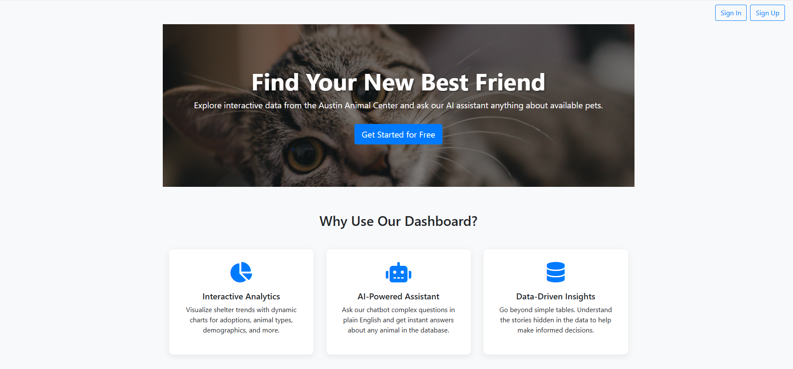
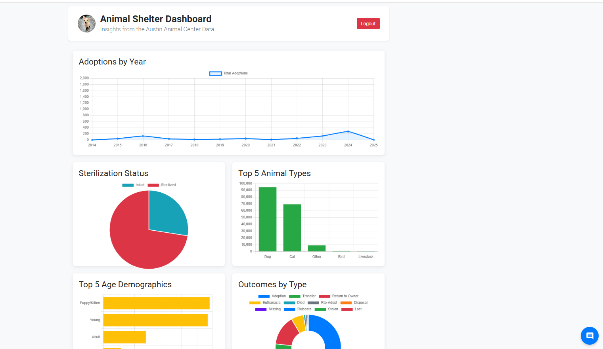

# Animal Shelter Analytics Dashboard & Chatbot

A Flask-based web application for analyzing data from the Austin Animal Center, featuring an interactive dashboard with dynamic charts and a chatbot for querying the dataset in natural language.

---

## Live Demo

**https://animal-analytics-dashboard-and-chatbot.onrender.com/**

---

## Showcase



---

## Key Features

*   **Secure User Authentication:** Modern, aesthetic, and secure sign-up and sign-in flows.
*   **Interactive Data Dashboard:** Visualizes key metrics with several dynamic charts:
    *   Adoptions by Year
    *   Sterilization Status
    *   Top 5 Animal Types & Age Demographics
    *   Overall Outcomes by Type
*   **Natural Language Chatbot:** A floating widget that understands complex, combined questions (e.g., *"how many adult dogs were adopted in 2018?"*).
*   **Optimized & Deployable:** Built with a production-ready structure using a cloud database (PostgreSQL) and optimized with database indexes for fast query performance.

---

## Screenshots

<table>
  <tr>
    <td align="center"><strong>Engaging Landing Page</strong></td>
    <td align="center"><strong>AI-Powered Chatbot</strong></td>
  </tr>
  <tr>
    <td></td>
    <td></td>
<td></td>
  </tr>
  <tr>
    <td align="center"><strong>Modern SignIn Form</strong></td>
    <td align="center"><strong>Clean SignUp Form</strong></td>
  </tr>
    <tr>
    <td></td>
    <td></td>
  </tr>
</table>

---

## Technology Stack

*   **Backend:** Python, Flask, SQLAlchemy
*   **Database:** PostgreSQL (for production), SQLite (for local development)
*   **Frontend:** HTML, CSS, JavaScript
*   **Data Visualization:** Chart.js
*   **Deployment:** Render, Gunicorn

---

## How to Run Locally

To set up and run this project on your local machine, follow these steps.

**Prerequisites:**
*   Python 3 & Git
*   An Anaconda distribution is recommended.

**1. Clone the repository:**
```bash
git clone https://github.com/Nagashree-MR/Animal-shelter-Chatbot.git
cd Animal-shelter-Chatbot